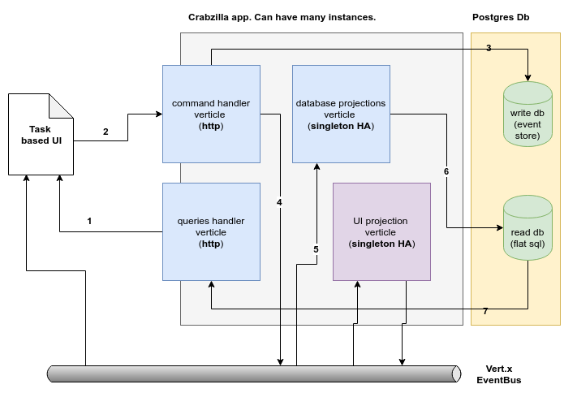

[](https://travis-ci.org/crabzilla/accounts)
[](https://codecov.io/gh/crabzilla/accounts)

# Crabzilla Accounts Example

### Overview

This is an app built with [Crabzilla](https://crabzilla.github.io/crabzilla/). 
I needed a better example than the dumb "example1 customer" used within Crabzilla tests so I got some inspiration from https://github.com/pmlopes/reactive-microservice-design But the intent here is not to be a microservice example: instead, it is an example of an app based on CQRS and Event Sourcing.



### Features

#### Business

* ```POST /commands/accounts/:entityId/make-deposit``` to make a deposit (and create an account if needed) 
* ```POST /commands/accounts/:entityId/make-withdraw``` to make a withdraw
* ```GET /index.html``` to see events published to UI
* ```GET /inconsistencies``` to see a self-check of inconsistencies between read and write models.
* Transfer between accounts (TODO using a Saga)

#### Technical

* The [UnitOfWork](https://github.com/crabzilla/crabzilla/blob/master/crabzilla-core/src/main/java/io/github/crabzilla/UnitOfWork.kt) resulting from a ```Command``` successful submission will be stored as JSON on the [units_of_work](https://github.com/crabzilla/accounts/blob/2493094caa9f77d931f87fe1b7c183463ea903c1/docker-entrypoint-initdb.d/example1_database.sql#L22) table.
* It leverages Vert.x HA features: event projector is a cluster aware and fail safe singleton verticle. Just run ```java -jar target/accounts-service.jar``` in another console to start a new app instance (http and Hazelcast ports will be increased by 1)

### Requirements

* Maven 
* Java 8 
* Docker-compose
* Graal -> you if want to package it as native app
* Port 8080 -> used by [Adminer db console](https://www.adminer.org/) 
* Port 5432 -> used by [Postgres database](https://www.postgresql.org/)
* Port 8081 (http write port), 8181 (http read port) and 5701 (Hazelcast) -> used by the `accounts-service` 

### Usage

First, start the adminer and database:

```bash
docker-compose up
```

then:

```bash
cd accounts-service
mvn clean install
java -jar target/accounts-service.jar
```

now let's open an account #2001 with $10.00:

```bash
curl -i -X POST \
   http://localhost:8081/commands/accounts/2001/make-deposit \
   -H 'cache-control: no-cache' \
   -H 'content-type: application/json' \
   -d '{"amount" : 10.00}'
```

the response should be similar to:

```
HTTP/1.1 303 See Other
accept: application/json
Location: http://localhost:8081/commands/accounts/units-of-work/1
content-length: 0
```
following the redirect: 

```
curl -i -X GET http://localhost:8081/commands/accounts/units-of-work/1
```

```
HTTP/1.1 200 OK
transfer-encoding: chunked
Content-Type: application/json
uowId: 1
```

```json
{  
   "entityName":"account",
   "entityId":2001,
   "commandId":"09b53f1f-ba5b-40a6-8bff-c302bd8fca4a",
   "commandName":"make-deposit",
   "command":{  
      "amount":10.0
   },
   "version":1,
   "events":[  
      {  
         "first":"AccountCreated",
         "second":{  
            "accountId":{  
               "value":2001
            }
         }
      },
      {  
         "first":"AmountDeposited",
         "second":{  
            "amount":10.0
         }
      }
   ]
}
```
then let's try to withdrawn $15 from that account #2001:

```bash
curl -i -X POST \
   http://localhost:8081/commands/accounts/2001/make-withdraw \
   -H 'cache-control: no-cache' \
   -H 'content-type: application/json' \
   -d '{"amount" : 15.00}' 
 ```

and you will receive something like;

```
HTTP/1.1 400 This account does not have enough balance
Content-Type: application/json
content-length: 0
```

so let's make a valid withdraw: 

```bash
curl -i -X POST \
   http://localhost:8081/commands/accounts/2001/make-withdraw \
   -H 'cache-control: no-cache' \
   -H 'content-type: application/json' \
   -d '{"amount" : 6.00}' 
 ```

the result:

```
HTTP/1.1 303 See Other
accept: application/json
Location: http://localhost:8081/commands/accounts/units-of-work/2
content-length: 0
```

following the redirect:

```
HTTP/1.1 200 OK
transfer-encoding: chunked
Content-Type: application/json
uowId: 2
```

```json
{  
   "entityName":"account",
   "entityId":2001,
   "commandId":"5e07d0a0-c322-4964-a055-18a0de413526",
   "commandName":"make-withdraw",
   "command":{  
      "amount":6.0
   },
   "version":2,
   "events":[  
      {  
         "first":"AmountWithdrawn",
         "second":{  
            "amount":6.0
         }
      }
   ]
}
```

Now let's see this account full track:

```bash
curl -i -X GET \
   http://localhost:8081/commands/accounts/2001/units-of-work \
   -H 'cache-control: no-cache' 
```

the result:

```bash
HTTP/1.1 200 OK
transfer-encoding: chunked
Content-Type: application/json
```

```json
[  
   {  
      "entityName":"account",
      "entityId":2001,
      "commandId":"09b53f1f-ba5b-40a6-8bff-c302bd8fca4a",
      "commandName":"make-deposit",
      "command":{  
         "amount":10.0
      },
      "version":1,
      "events":[  
         {  
            "first":"AccountCreated",
            "second":{  
               "accountId":{  
                  "value":2001
               }
            }
         },
         {  
            "first":"AmountDeposited",
            "second":{  
               "amount":10.0
            }
         }
      ]
   },
   {  
      "entityName":"account",
      "entityId":2001,
      "commandId":"5e07d0a0-c322-4964-a055-18a0de413526",
      "commandName":"make-withdraw",
      "command":{  
         "amount":6.0
      },
      "version":2,
      "events":[  
         {  
            "first":"AmountWithdrawn",
            "second":{  
               "amount":6.0
            }
         }
      ]
   }
]
```

Finally, let's see how is the account read model:

```bash
curl -i -X GET \
   http://localhost:8181/accounts/2001 \
   -H 'cache-control: no-cache' 
```

returning:

```
HTTP/1.1 200 OK
Content-Type: application/json
content-length: 44

{
  "accountId" : 2001,
  "balance" : 4.00
}
```

## Developer's use cases

### Recreating the database from scratch:

```bash
cd accounts
docker-compose down -v
docker-compose up
```

### Access the database using Adminer:

* Open your browser http://localhost:8080
* Select `PostgreSQL` as database
* Set `user1` as username
* Set `pwd1` as passwor
* Set `example1`as database 

### Testing with Gatling:

```bash
cd accounts-gatling
mvn gatling:test
```
then you will get something like: 

```
================================================================================
2019-05-13 12:14:20                                         118s elapsed
---- Requests ------------------------------------------------------------------
> Global                                                   (OK=60     KO=0     )
> OpeningAccounts                                          (OK=60     KO=0     )

---- JustOpeningAccounts -------------------------------------------------------
[##########################################################################]100%
          waiting: 0      / active: 0      / done: 60    
================================================================================

Simulation computerdatabase.BasicSimulation completed in 117 seconds
Parsing log file(s)...
Parsing log file(s) done
Generating reports...

================================================================================
---- Global Information --------------------------------------------------------
> request count                                         60 (OK=60     KO=0     )
> min response time                                     14 (OK=14     KO=-     )
> max response time                                    768 (OK=768    KO=-     )
> mean response time                                   276 (OK=276    KO=-     )
> std deviation                                        323 (OK=323    KO=-     )
> response time 50th percentile                         49 (OK=49     KO=-     )
> response time 75th percentile                        692 (OK=692    KO=-     )
> response time 95th percentile                        754 (OK=754    KO=-     )
> response time 99th percentile                        767 (OK=767    KO=-     )
> mean requests/sec                                  0.508 (OK=0.508  KO=-     )
---- Response Time Distribution ------------------------------------------------
> t < 800 ms                                            60 (100%)
> 800 ms < t < 1200 ms                                   0 (  0%)
> t > 1200 ms                                            0 (  0%)
> failed                                                 0 (  0%)
================================================================================

Reports generated in 0s.
Please open the following file: .../accounts/accounts-gatling/target/gatling/basicsimulation-20190513151222222/index.html

```

Cool, now let's see all opened acccounts:

```bash
curl -i -X GET \
   http://localhost:8081/accounts \
   -H 'cache-control: no-cache' 
```

And you should see a big JSON with 60 accounts.

Ok, but now let's see if both read and write models are in sync and consistent:

```bash
curl -i -X GET \
   http://localhost:8081/inconsistencies \
   -H 'cache-control: no-cache' 
```

and hopefully you will get:

```
Both write and read models seems to be consistent, yay!
```
